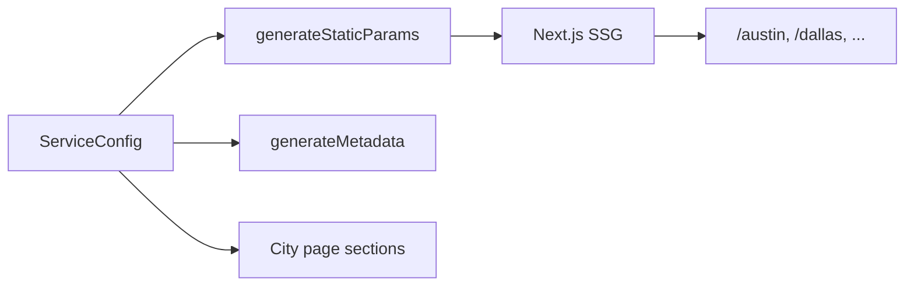

# City SEO Pages

City pages are the core local SEO pattern in next-service-pages. One config file defines N cities; the framework generates a static landing page for each at build time.

## URL structure

```
/                    → Homepage with cities grid
/austin              → "Home services in Austin"
/round-rock          → "Home services in Round Rock"
/blog                → Blog index
/blog/my-post-slug   → Individual blog post
```

City slugs come from `serviceArea.cities[].slug` in `ServiceConfig`.

## How it works



### 1. Static generation

`app/(site)/[city]/page.tsx` exports `generateStaticParams()`:

```typescript
export function generateStaticParams(): Array<{ city: string }> {
  return getAllCitySlugs(siteConfig).map((city) => ({ city }));
}
```

At build time, Next.js pre-renders one HTML page per city. No database required.

### 2. Metadata

`generateMetadata()` produces per-city titles and descriptions:

- **Title:** `{ServiceType} in {CityName} | {BusinessName}` (via `titleTemplate`)
- **Description:** City-specific sentence with business name, service type, and phone

Open Graph tags inherit from config `seo.ogImage`.

### 3. Page sections

Each city page renders:

| Section  | Source                              | Purpose                                       |
| -------- | ----------------------------------- | --------------------------------------------- |
| Hero     | `buildCityHeadline()` + description | H1 + CTA phone link                           |
| Services | `config.services`                   | Service offering cards                        |
| Why Us   | `config.whyUs`                      | Trust signals                                 |
| FAQ      | `config.faqs` + city context        | City-aware FAQ with placeholder interpolation |
| CTA      | `config.phone`                      | Final conversion block                        |

### 4. FAQ interpolation

FAQ templates use placeholders replaced at render time:

```typescript
{
  question: 'Do you serve {{cityName}}, {{state}}?',
  answer: 'Yes — {{businessName}} proudly serves {{cityName}}...',
}
```

Helpers in `lib/config/city-helpers.ts`: `buildCityContext()`, `interpolateTemplate()`, `resolveCityFaqs()`.

## Adding a city

Add to `serviceArea.cities` in config:

```typescript
{
  slug: 'san-marcos',
  name: 'San Marcos',
  county: 'Hays',
  lat: 29.8833,
  lng: -97.9414,
}
```

Rebuild — `/san-marcos` is generated automatically.

## Disabling city pages

```typescript
features: {
  cityPages: false,
}
```

`generateStaticParams()` returns an empty array; no city routes are built.

## Route validation

City slugs are validated with Zod (`CitySlugParamsSchema`) before lookup. Invalid slugs return 404 via `notFound()`.

## SEO best practices

- Use unique, descriptive slugs matching how locals search (`round-rock` not `rr`)
- Include county for FAQ depth and local relevance
- Keep `serviceType` and `serviceVerb` aligned with target keywords
- Add lat/lng when you implement LocalBusiness schema (roadmap item)
- Link to city pages from the homepage cities grid (automatic)

## Scaling to dozens of cities

Static generation handles hundreds of city pages efficiently. For thousands of cities, consider:

- Incremental Static Regeneration (ISR) with `revalidate`
- Paginated service area index pages
- Sitemap generation (roadmap)

See [Configuration Reference](./configuration.md) for full `ServiceConfig` details.
